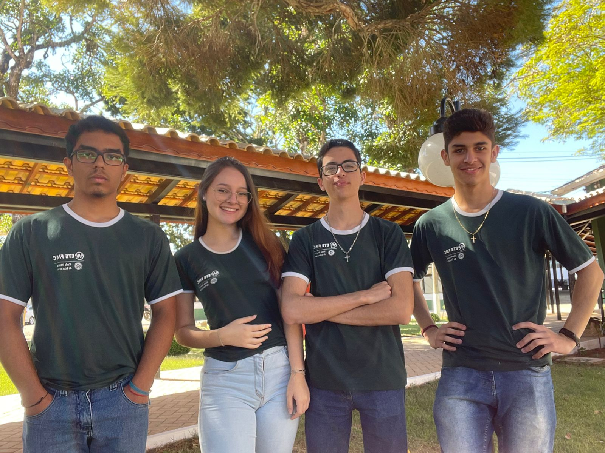

# LEES - Economic and Sustainable Electronic Trash Can

**LEES** - Economic and Sustainable Electronic Trash Can - is an innovative smart trash can developed for **ProjETE 2K23**, a technological project fair held annually by **ETE FMC**, the first technical school in Latin America.  
Designed to promote sustainability and ensure a brighter and more promising future for upcoming generations, LEES automates waste sorting based on the material of each discarded item, making recycling easier and ensuring proper waste disposal. This significantly contributes to reducing environmental impact and reinforces the commitment to a sustainable future.

---

## Project Functionality  

The functionality of LEES can be described in three main steps:  

- **Analysis**:  
  In this step, the project collects information about the discarded waste using two HC-SR04 ultrasonic sensors and four capacitive sensors developed by the team from recyclable materials.  
  The ultrasonic sensors work similarly to bat echolocation by emitting high-frequency sounds (40 kHz), inaudible to humans, which bounce back as an echo upon hitting an object. The time between sound emission and echo return is used by the ESP-32, the project's microcontroller, to calculate the distance between the sensors and the waste, determining its position in the box.  
  Meanwhile, the capacitive sensors detect changes in the nearby electric field, similar to how touchscreens work. Developed with a circuit akin to an astable multivibrator, these sensors vary their output frequency based on the dielectric permittivity of the discarded material, allowing the waste material type to be identified.  

- **Processing**:  
  The ESP-32 performs the necessary calculations with the data collected by the sensors and organizes it into a single message, sent to the project's database—Firebase Realtime Database—via an HTTP request.  
  Next, the "brain" of LEES comes into play. A program running on a computer collects this information from the database through another HTTP request, processes the data, and adapts it into the required format for the trash can's neural network, a Random Forest Classifier model from Scikit-Learn. This model analyzes the received data and classifies the discarded material as metal, glass, plastic, paper, or undefined.  
  Finally, the classification is sent back to the database, allowing the ESP-32 to access this information and direct the waste to the appropriate trash bin.  

- **Sorting**:  
  In the final step, the project uses two electric window motors from cars, powered by a 200W ATX power supply and controlled by the ESP-32 with H-bridge drivers developed by the team.  
  First, one motor moves the box containing the waste along the internal track of LEES to the correct bin, while the other motor, responsible for opening and closing the box, disposes of the waste into the corresponding bin (Metal, Glass, Plastic, Paper, or Undefined).  
  After disposal, the box is closed and returns to its initial position, ready to receive new waste.  

In addition to the main sorting process, LEES also features a website that informs users about the project, sends alerts if a bin is full, detected by infrared sensors positioned over each compartment, and provides data on the quantity of discarded materials by type.  

To learn more about the project, check out the LEES logbook, a document developed by the team throughout the project with photos, videos, files, and versions of the codes used, or watch the video recorded by the group.  
- [Lobgook](https://eteacojeorg-my.sharepoint.com/:o:/g/personal/rosa_rafael_edu_etefmc_com_br/EkO5bkhdYG5FoNh1IA1nRyUB2ByUAueX1Sehp29Ed4tsqw?e=4kbgHL)  
- [Video](https://eteacojeorg-my.sharepoint.com/:v:/g/personal/kaua_ribeiro_edu_etefmc_com_br/EdsKwRQHleRKleLEk93FQxsBkLeLHDcyaQhE6t2bfR_1Nw?nav=eyJyZWZlcnJhbEluZm8iOnsicmVmZXJyYWxBcHAiOiJTdHJlYW1XZWJBcHAiLCJyZWZlcnJhbFZpZXciOiJTaGFyZURpYWxvZy1MaW5rIiwicmVmZXJyYWxBcHBQbGF0Zm9ybSI6IldlYiIsInJlZmVycmFsTW9kZSI6InZpZXcifX0%3D&e=2glZtT)  

---

## Technologies Used  

### Software:
- Artificial Intelligence: Scikit-Learn Random Forest Classifier model  
- Web Interface: Interactive dashboard  
- Database: Firebase (Realtime Database)  

### Hardware:
- Processor: ESP-32  
- Sensors:  
  - Capacitive sensors made from recyclable materials, developed by the team  
  - Ultrasonic sensors  
  - Infrared sensors  
- Actuators: Low-RPM motors recycled from car electric window systems  
- Power Supply: ATX  

### Programming Languages and Libraries:
- Programming Languages: Python, C++, HTML5, CSS3, JavaScript  
- Libraries and Frameworks:  
  - AI: Scikit-Learn  
  - Data Analysis: Pandas  
  - Database: Firebase  
- Protocols and Technologies: HTTP  

---

## Founders  

 

  

 

- **Samuel de Jesus Pereira**  
- **Marianne Lima**  
- **Kauã Ribeiro** - Leader  
  [LinkedIn](https://www.linkedin.com/in/kaua-ribeiro17/) | [GitHub](https://github.com/Kauakim)  
- **Rafael Carlos**  

---

**Acknowledgments**  
The project received crucial support from **ETE-FMC**, guided by professors **Ana Letícia Gomes Gonçalves**, **Fábio Teixeira**, and **José Manoel**.
