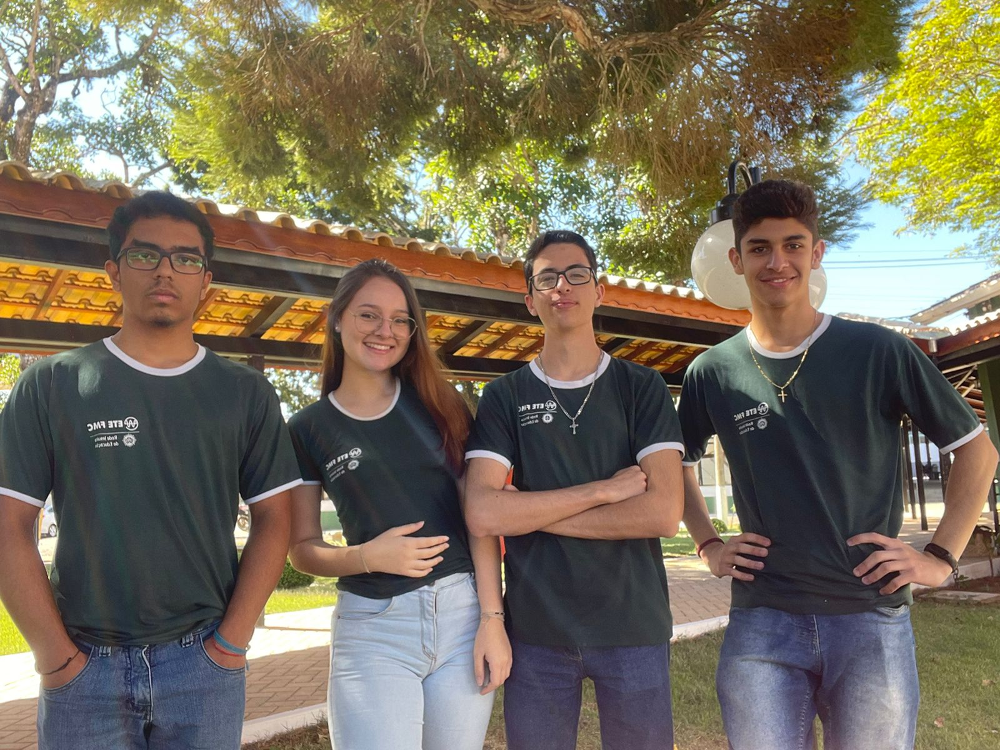

# LEES - Lixeira Eletrônica Econômica Sustentável

A **LEES** - Lixeira Eletrônica Econômica Sustentável - é um lixeira inteligente inovadora desenvolvida para a **ProjETE 2K23**, uma feira de projetos tecnológicos realizada anualmente pela **ETE FMC**, a primeira escola técnica da América Latina.
Projetada para promover a sustentabilidade, a LEES automatiza a separação de resíduos com base no material de cada item descartado, facilitando a reciclagem e garantindo o descarte adequado dos resíduos, contribuindo significativamente para a redução do impacto ambiental e reforçando o compromisso com um futuro mais sustentável.

---

## Funcionamento do projeto

Para saber mais sobre o projeto, acesse o link do diário de bordo da LEES, documento desenvolvido ao longo de todo o processo de desenvolvimento do projeto pela equipe com fotos, vídeos, arquivos e versões dos códigos utilizados, ou assista ao vídeo gravado pelo grupo.
- [Diário de Bordo](https://eteacojeorg-my.sharepoint.com/:o:/g/personal/rosa_rafael_edu_etefmc_com_br/EkO5bkhdYG5FoNh1IA1nRyUB2ByUAueX1Sehp29Ed4tsqw?e=4kbgHL)
- [Vídeo](https://eteacojeorg-my.sharepoint.com/:v:/g/personal/kaua_ribeiro_edu_etefmc_com_br/EdsKwRQHleRKleLEk93FQxsBkLeLHDcyaQhE6t2bfR_1Nw?nav=eyJyZWZlcnJhbEluZm8iOnsicmVmZXJyYWxBcHAiOiJTdHJlYW1XZWJBcHAiLCJyZWZlcnJhbFZpZXciOiJTaGFyZURpYWxvZy1MaW5rIiwicmVmZXJyYWxBcHBQbGF0Zm9ybSI6IldlYiIsInJlZmVycmFsTW9kZSI6InZpZXcifX0%3D&e=2glZtT)

---

## Tecnologias Utilizadas

### Software:
- Inteligência Artificial: Modelo Random Forest Classifier do SKT-Learn
- Interface Web: Dashboard interativo
- Banco de Dados: Firebase (Realtime Database)

### Hardware:
- Processamento: ESP-32
- Sensoriamento:
  - Sensores capacitivos feitos a partir de materiais recicláveis, desenvolvidos pelo grupo
  - Sensores ultrassônicos
  - Sensores infravermelho
- Atuadores: Motores de baixa rotação reciclados de sistemas de vidro elétrico de carros
- Alimentação: Fonte ATX

### Linguagens e Bibliotecas:
- Linguagens de Programação: Python, C++, HTML5, CSS3, JavaScript
- Bibliotecas e Frameworks:
  - IA: Scikit-learn
  - Análise de Dados: Pandas
  - Banco de Dados: Firebase
- Protocolos e Tecnologias: HTTP 

---

## Fundadores

- **Samuel de Jesus Pereira**
- **Marianne Lima** 
- **Kauã Ribeiro** - Líder  
  [LinkedIn](https://www.linkedin.com/in/kaua-ribeiro17/) | [GitHub](https://github.com/Kauakim)  
- **Rafael Carlos**  

 

  

 

---

**Agradecimentos**  
O projeto contou com o apoio crucial da **ETE-FMC**, com orientação dos professores **Ana Letícia Gomes Gonçalves**, **Fábio Teixeira** e **José Manoel**.
